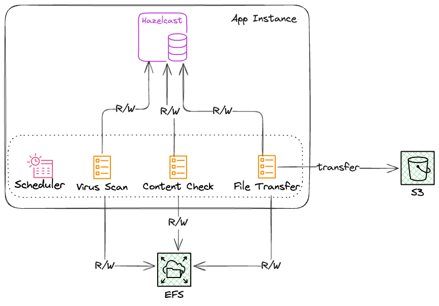

# Tasks distribution using Hazelcast
## Introduction
In many scenarios, distributing tasks across multiple nodes is essential for achieving scalability and efficiency. Tools like [Kafka](https://kafka.apache.org/), [Spark](https://spark.apache.org/), [Flink](https://flink.apache.org/), and [Hazelcast](https://hazelcast.com/) are commonly used for such purposes, each offering unique features and advantages tailored to specific use cases.

For this project, I chose Hazelcast due to its ease of use and the robust APIs it provides for distributed data structures and computing. Hazelcast's simplicity and flexibility make it an excellent choice for building distributed systems efficiently.

## The Use Case
Users can upload multiple files to the server, but only supported file types will be processed and stored in a designated storage solution, such as Amazon S3, Google Cloud Storage, or other providers. The validation process can be time-intensive, necessitating the distribution of tasks across multiple nodes to improve efficiency.

Before validation, all files must undergo a virus scan to ensure security, which is also a resource-intensive process. Once a file passes both the virus scan and validation, it is transferred to the final storage location.

To handle varying workloads, the system must be elastic, scaling up or down dynamically based on the number of uploaded files. Additionally, it must be fault-tolerant to prevent data loss and ensure reliability throughout the process.

## Solution Concept
The virus scan, validation, and file transfer are three distinct tasks that can be distributed across multiple nodes. Each task is sequential and dependent on the successful completion of the previous one. For example, a file must pass the virus scan before it can be validated, and it must pass validation before being transferred to the final storage location.

To manage the process, the following statuses are used:
* `PENDING_VIRUS_SCAN`: The task is awaiting a virus scan.
* `PENDING_TYPE_CHECK`: The task is awaiting validation.
* `PENDING_TRANSFER`: The task is awaiting transfer to the final storage.
* `INFECTED`: The file contains a virus and cannot be processed.
* `UNSUPPORTED_FORMAT`: The file format is unsupported and cannot be processed.

When a user uploads a file, the application registers the file in a Hazelcast distributed cache using the file name and sets its status to `PENDING_VIRUS_SCAN`.
The application then distributes the task to a node for virus scanning. Once the scan is complete:
* If the file passes, the status is updated to `PENDING_TYPE_CHECK`, and the task is distributed to a node for validation.
* If the file is infected, the status is updated to `INFECTED`.

During validation:
* If the file is unsupported, the status is updated to `UNSUPPORTED_FORMAT`.
* If the file passes, the status is updated to `PENDING_TRANSFER`, and the task is distributed to a node for transfer.
* If the file passes all stages, it is transferred to the final storage location, and the entry is removed from the distributed cache.

Hazelcast distributed map ensures data redundancy and fault tolerance through replication:
* Each entry in the distributed map can have multiple replicas stored across different nodes, ensuring that data remains available even if a node fails.
* Only one node acts as the owner of an entry. The owner node manages the entry’s lifecycle, processes updates, and propagates changes to replica nodes.

Tasks are scheduled on each node, querying local entries within the distributed map:
* Entries are filtered based on their status (e.g., `PENDING_VIRUS_SCAN`, `PENDING_TYPE_CHECK`).
* The corresponding tasks are then processed locally, ensuring efficient utilization of resources and minimizing network overhead.



I use [Quarkus](https://quarkus.io/) to build the application, leveraging its reactive programming model and support for Hazelcast. Quarkus provides a lightweight, fast, and efficient framework for building cloud-native applications, making it an ideal choice for this project.

This approach ensures scalability, fault tolerance, and efficient task distribution, enabling the system to handle high workloads while maintaining data integrity and security.

**Note**: This project is a proof of concept and does not implement the actual virus scanning, validation, or file transfer processes. Instead, it focuses on demonstrating task distribution and management using Hazelcast. The Quarkus can be easily replaced by [Spring Boot](https://spring.io/projects/spring-boot), [Micronaut](https://micronaut.io/), or other frameworks with support for Hazelcast.

Additionally, this project assumes that uploaded files are stored in a shared location accessible to all nodes in the cluster. For a stateless solution, cache data should be stored in an external database to ensure consistency and durability across nodes.

For practical implementation:
* Virus scanning: Tools like [ClamAV](https://www.clamav.net/) can be integrated.
* File validation: [Apache Tika](https://tika.apache.org/) can be used for format and metadata analysis.
* File transfer: Solutions like the [AWS SDK](https://aws.amazon.com/sdk-for-java/) or [Google Cloud Storage SDK](https://developers.google.com/api-client-library/java) can handle file uploads to cloud storage services.
* Write-through caching: To ensure data consistency, a [write-through cache]((https://hazelcast.com/glossary/cache-access-patterns/#write-through-cache)) can be implemented to synchronize cache updates with an external database.

## Building the project
### Prerequisites
- Java 21
- Maven 3
- Docker

To build the project, run the following command:
```shell
mvn clean install
```

To build the Docker image, run the following command:
```shell
 docker build -f src/main/docker/Dockerfile.jvm -t hazelcast-crunch .
```

## Running the instances
It is recommended to create a docker network to run the instances. To create a docker network, run the following command:
```shell
docker network create hazelcast-network
```

Then run the following command to start the first instance:
```shell
docker run \
    -it \
    --network hazelcast-network \
    --rm \
    -p 8080:8080 hazelcast-crunch
```
and a second instance:
```shell
docker run \
    -it \
    --network hazelcast-network \
    --rm \
    -p 8081:8080 hazelcast-crunch
```

where Docker parameters:
* `-it`: Starts an interactive session, allowing you to stop the member with Ctrl+C.
* `--rm`: Tells Docker to remove the container from its local cache after it exits.
* `--network`: Allows you to connect to clusters, using an alias.
* `-p`: Maps the container port to the host port.

## Testing the application
To test the application, you can simulate the file uploading using the following command:
```shell
curl -v -H "Content-Type: application/json" -d '{"name":"A-file"}' http://localhost:8080/api/file
curl -v -H "Content-Type: application/json" -d '{"name":"B-file"}' http://localhost:8080/api/file
curl -v -H "Content-Type: application/json" -d '{"name":"C-file"}' http://localhost:8080/api/file
curl -v -H "Content-Type: application/json" -d '{"name":"D-file"}' http://localhost:8080/api/file
curl -v -H "Content-Type: application/json" -d '{"name":"E-file"}' http://localhost:8080/api/file
curl -v -H "Content-Type: application/json" -d '{"name":"F-file"}' http://localhost:8080/api/file
```

You can check the application logs to see the tasks being evenly distributed across the nodes and processed accordingly.
